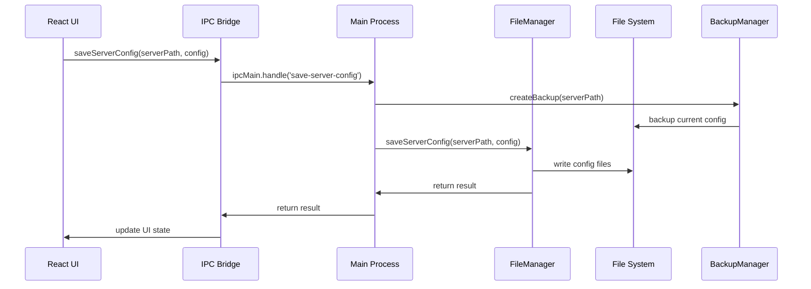
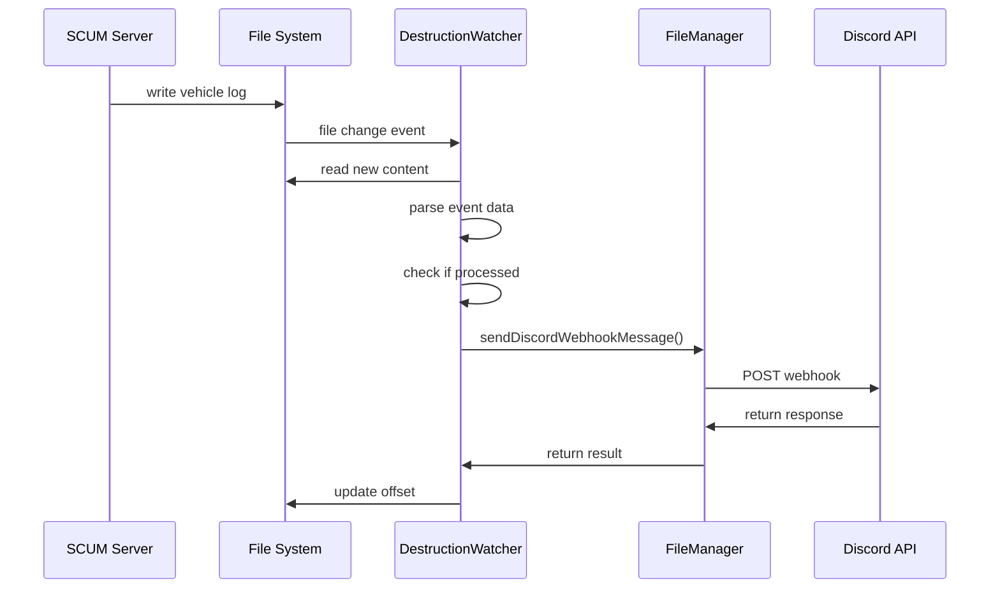
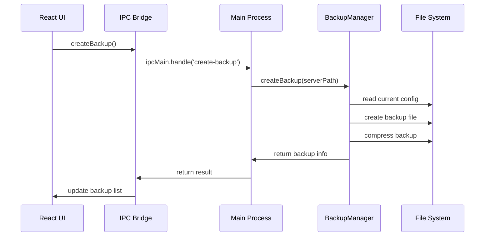

# ScumServerManager - Arquitetura Técnica

## Visão Geral da Arquitetura

O ScumServerManager é uma aplicação desktop multiplataforma construída com Electron, React e TypeScript, seguindo uma arquitetura de camadas bem definidas e princípios de design modernos.

## Diagrama de Arquitetura

```
┌─────────────────────────────────────────────────────────────────┐
│                        Presentation Layer                       │
├─────────────────────────────────────────────────────────────────┤
│  React App (Renderer Process)                                   │
│  ┌─────────────┐ ┌─────────────┐ ┌─────────────┐ ┌─────────────┐ │
│  │   Pages     │ │ Components  │ │  Contexts   │ │   Utils     │ │
│  │             │ │             │ │             │ │             │ │
│  │ Dashboard   │ │ Navigation  │ │ServerConfig │ │playerUtils  │ │
│  │ Settings    │ │ Forms       │ │PlayerStats  │ │             │ │
│  │ Monitoring  │ │ Tables      │ │             │ │             │ │
│  │ Discord     │ │ Charts      │ │             │ │             │ │
│  └─────────────┘ └─────────────┘ └─────────────┘ └─────────────┘ │
└─────────────────────────────────────────────────────────────────┘
                              │
                              │ IPC Communication
                              ▼
┌─────────────────────────────────────────────────────────────────┐
│                        Communication Layer                      │
├─────────────────────────────────────────────────────────────────┤
│  Electron IPC Bridge                                            │
│  ┌─────────────┐ ┌─────────────┐ ┌─────────────┐ ┌─────────────┐ │
│  │  Preload    │ │   IPC Main  │ │   IPC Render│ │  TypeScript │ │
│  │             │ │             │ │             │ │             │ │
│  │exposeInMain │ │   Handlers  │ │   Invoke    │ │   Types     │ │
│  │World()      │ │   Events    │ │   Listen    │ │   Interfaces│ │
│  │             │ │   Channels  │ │   Remove    │ │             │ │
│  └─────────────┘ └─────────────┘ └─────────────┘ └─────────────┘ │
└─────────────────────────────────────────────────────────────────┘
                              │
                              │ Business Logic
                              ▼
┌─────────────────────────────────────────────────────────────────┐
│                        Business Layer                           │
├─────────────────────────────────────────────────────────────────┤
│  Core Services                                                  │
│  ┌─────────────┐ ┌─────────────┐ ┌─────────────┐ ┌─────────────┐ │
│  │FileManager  │ │BackupManager│ │Destruction  │ │   Utils     │ │
│  │             │ │             │ │Watcher      │ │             │ │
│  │readConfig   │ │createBackup │ │startWatcher │ │sleep()      │ │
│  │saveConfig   │ │listBackups  │ │processFile  │ │convertUtf16 │ │
│  │sendDiscord  │ │restoreBackup│ │parseEvent   │ │generateId   │ │
│  │validate     │ │deleteBackup │ │sendNotify   │ │             │ │
│  └─────────────┘ └─────────────┘ └─────────────┘ └─────────────┘ │
└─────────────────────────────────────────────────────────────────┘
                              │
                              │ System Integration
                              ▼
┌─────────────────────────────────────────────────────────────────┐
│                        Integration Layer                        │
├─────────────────────────────────────────────────────────────────┤
│  External Systems                                               │
│  ┌─────────────┐ ┌─────────────┐ ┌─────────────┐ ┌─────────────┐ │
│  │ File System │ │   Discord   │ │   SCUM      │ │   SteamCMD  │ │
│  │             │ │             │ │             │ │             │ │
│  │INI Files    │ │Webhooks API │ │Server Logs  │ │Update Tool  │ │
│  │JSON Files   │ │REST API     │ │Config Files │ │Install Tool │ │
│  │Log Files    │ │Rate Limits  │ │Game Files   │ │Validate Tool│ │
│  │Backup Files │ │Error Handling│ │Process Mgmt │ │             │ │
│  └─────────────┘ └─────────────┘ └─────────────┘ └─────────────┘ │
└─────────────────────────────────────────────────────────────────┘
```

## Padrões de Design Utilizados

### 1. Arquitetura em Camadas (Layered Architecture)

**Princípio**: Separação clara de responsabilidades entre diferentes níveis da aplicação.

**Camadas**:
- **Presentation**: React components, pages, UI logic
- **Communication**: Electron IPC, preload scripts
- **Business**: Core services, business logic
- **Integration**: External systems, file operations

**Benefícios**:
- Manutenibilidade
- Testabilidade
- Escalabilidade
- Reutilização de código

### 2. Injeção de Dependência (Dependency Injection)

```typescript
// Exemplo: FileManager injetado no DestructionWatcher
export async function startVehicleDestructionWatcher(fileManager: FileManager) {
  // fileManager é injetado como dependência
  const result = await fileManager.sendDiscordWebhookMessage(webhookUrl, msg);
}
```

### 3. Observer Pattern (Padrão Observador)

```typescript
// Exemplo: Watcher observando mudanças em arquivos
const watcher = fs.watch(logsPath, { recursive: false }, async (eventType, filename) => {
  if (filename && filename.startsWith('vehicle_destruction_') && filename.endsWith('.log')) {
    await processFile(filename, webhookUrl);
  }
});
```

### 4. Factory Pattern (Padrão Fábrica)

```typescript
// Exemplo: Criação de diferentes tipos de eventos
function createEventEmoji(eventType: string): string {
  switch (eventType) {
    case 'Disappeared': return '🚗';
    case 'ForbiddenZoneTimerExpired': return '⏰';
    case 'Destroyed': return '💥';
    default: return '❓';
  }
}
```

### 5. Singleton Pattern (Padrão Singleton)

```typescript
// Exemplo: Instâncias únicas de managers
const fileManager = new FileManager();
const backupManager = new BackupManager();
```

## Fluxo de Dados

### 1. Fluxo de Configuração do Servidor



### 2. Fluxo de Monitoramento de Veículos



### 3. Fluxo de Backup e Restauração



## Decisões de Design

### 1. Electron como Plataforma

**Decisão**: Usar Electron para aplicação desktop multiplataforma.

**Justificativa**:
- Desenvolvimento web familiar (React/TypeScript)
- Distribuição multiplataforma
- Acesso a APIs nativas do sistema
- Comunicação IPC robusta

**Alternativas Consideradas**:
- Tauri (menor footprint, mas menos maduro)
- Qt (performance melhor, mas desenvolvimento mais complexo)
- Native (melhor performance, mas desenvolvimento específico por plataforma)

### 2. React com TypeScript

**Decisão**: Usar React com TypeScript para o frontend.

**Justificativa**:
- Type safety
- Componentização
- Ecosystem maduro
- Developer experience

**Alternativas Consideradas**:
- Vue.js (menor curva de aprendizado)
- Svelte (melhor performance, mas ecosystem menor)
- Vanilla JS (mais controle, mas mais código boilerplate)

### 3. Arquitetura de Camadas

**Decisão**: Separar claramente as responsabilidades em camadas.

**Justificativa**:
- Manutenibilidade
- Testabilidade
- Escalabilidade
- Reutilização

**Implementação**:
- Presentation: React components
- Communication: Electron IPC
- Business: Core services
- Integration: External systems

### 4. Sistema de Watchers

**Decisão**: Usar watchers de arquivo para monitoramento em tempo real.

**Justificativa**:
- Detecção imediata de mudanças
- Baixo overhead
- Confiabilidade

**Implementação**:
- fs.watch() para detecção de mudanças
- Polling como fallback
- Controle de offsets para leitura eficiente
- Sistema anti-duplicação

### 5. Persistência em JSON

**Decisão**: Usar arquivos JSON para persistência de dados.

**Justificativa**:
- Simplicidade
- Legibilidade
- Portabilidade
- Debugging fácil

**Alternativas Consideradas**:
- SQLite (melhor para dados complexos)
- YAML (mais legível, mas menos performático)
- Binary (melhor performance, mas menos legível)

## Padrões de Comunicação

### 1. IPC (Inter-Process Communication)

**Padrão**: Request-Response via IPC handlers.

```typescript
// Main Process
ipcMain.handle('read-server-config', async (event, serverPath: string) => {
  return await fileManager.readServerConfig(serverPath);
});

// Renderer Process
const config = await window.electronAPI.readServerConfig(serverPath);
```

**Benefícios**:
- Segurança (contextBridge)
- Type safety
- Error handling
- Async/await support

### 2. Event-Driven Architecture

**Padrão**: Eventos para comunicação assíncrona.

```typescript
// Main Process
ipcMain.on('start-update-server-with-steamcmd-stream', (event, steamcmdPath, installPath) => {
  // Process update
  ipcRenderer.send('update-server-log', data);
});

// Renderer Process
window.electronAPI.onUpdateServerLog((event, data) => {
  console.log('Update log:', data);
});
```

### 3. Context API (React)

**Padrão**: Context API para estado global.

```typescript
const ServerConfigContext = createContext<ServerConfigContextType | undefined>(undefined);

export const useServerConfig = () => {
  const context = useContext(ServerConfigContext);
  if (!context) {
    throw new Error('useServerConfig must be used within a ServerConfigProvider');
  }
  return context;
};
```

## Estratégias de Performance

### 1. Lazy Loading

**Implementação**: Carregamento sob demanda de componentes.

```typescript
const Dashboard = lazy(() => import('./pages/Dashboard'));
const ServerSettings = lazy(() => import('./pages/ServerSettings'));
```

### 2. Debouncing

**Implementação**: Debounce em inputs para reduzir chamadas desnecessárias.

```typescript
const debouncedSave = useMemo(
  () => debounce(async (config) => {
    await saveConfig(config);
  }, 1000),
  []
);
```

### 3. Caching

**Implementação**: Cache de configurações e dados do servidor.

```typescript
const [serverCache, setServerCache] = useState<ServerCache | null>(null);

const loadServerCache = async () => {
  const cache = await window.electronAPI.loadServerCache();
  if (cache) {
    setServerCache(cache);
  }
};
```

### 4. Streaming

**Implementação**: Processamento de arquivos em chunks.

```typescript
const fd = fs.createReadStream(logFile, { start: lastOffset, encoding: 'utf8' });
for await (const chunk of fd) {
  buffer += chunk;
  let lines = buffer.split(/\r?\n/);
  buffer = lines.pop() || '';
  // Process lines
}
```

## Estratégias de Error Handling

### 1. Try-Catch em Camadas

```typescript
// Business Layer
try {
  const result = await fileManager.readServerConfig(serverPath);
  return result;
} catch (error) {
  console.error('Error reading server config:', error);
  throw new Error('Failed to read server configuration');
}

// Presentation Layer
try {
  const config = await window.electronAPI.readServerConfig(serverPath);
  setConfig(config);
} catch (error) {
  setError(error.message);
  showNotification('Erro ao carregar configurações', 'error');
}
```

### 2. Error Boundaries (React)

```typescript
class ErrorBoundary extends React.Component {
  constructor(props) {
    super(props);
    this.state = { hasError: false };
  }

  static getDerivedStateFromError(error) {
    return { hasError: true };
  }

  componentDidCatch(error, errorInfo) {
    console.error('Error caught by boundary:', error, errorInfo);
  }

  render() {
    if (this.state.hasError) {
      return <h1>Algo deu errado.</h1>;
    }
    return this.props.children;
  }
}
```

### 3. Retry Logic

```typescript
const retryOperation = async (operation: () => Promise<any>, maxRetries = 3) => {
  for (let i = 0; i < maxRetries; i++) {
    try {
      return await operation();
    } catch (error) {
      if (i === maxRetries - 1) throw error;
      await sleep(1000 * Math.pow(2, i)); // Exponential backoff
    }
  }
};
```

## Estratégias de Teste

### 1. Unit Tests

```typescript
describe('FileManager', () => {
  it('should read server config correctly', async () => {
    const fileManager = new FileManager();
    const config = await fileManager.readServerConfig(mockServerPath);
    expect(config).toBeDefined();
    expect(config.serverSettings).toBeDefined();
  });
});
```

### 2. Integration Tests

```typescript
describe('IPC Communication', () => {
  it('should handle save-server-config correctly', async () => {
    const result = await window.electronAPI.saveServerConfig(mockServerPath, mockConfig);
    expect(result.success).toBe(true);
  });
});
```

### 3. E2E Tests

```typescript
describe('Server Configuration Flow', () => {
  it('should save and load server configuration', async () => {
    await page.goto('/server-settings');
    await page.fill('[data-testid="server-port"]', '8900');
    await page.click('[data-testid="save-config"]');
    await expect(page.locator('[data-testid="success-message"]')).toBeVisible();
  });
});
```

## Métricas e Monitoramento

### 1. Performance Metrics

```typescript
// Tempo de resposta das operações
const startTime = Date.now();
const result = await operation();
const responseTime = Date.now() - startTime;
console.log(`Operation took ${responseTime}ms`);
```

### 2. Error Tracking

```typescript
// Log de erros com contexto
console.error('[FileManager] Error reading config:', {
  serverPath,
  error: error.message,
  stack: error.stack,
  timestamp: new Date().toISOString()
});
```

### 3. Usage Analytics

```typescript
// Tracking de uso de funcionalidades
const trackFeatureUsage = (feature: string) => {
  console.log(`[Analytics] Feature used: ${feature} at ${new Date().toISOString()}`);
};
```

## Considerações de Segurança

### 1. Context Bridge

```typescript
// Exposição segura de APIs
contextBridge.exposeInMainWorld('electronAPI', {
  readServerConfig: (serverPath: string) => ipcRenderer.invoke('read-server-config', serverPath),
  // Apenas APIs necessárias são expostas
});
```

### 2. Input Validation

```typescript
// Validação de entrada
const validateServerPath = (path: string): boolean => {
  return path && path.length > 0 && fs.pathExists(path);
};
```

### 3. File Path Sanitization

```typescript
// Sanitização de caminhos de arquivo
const sanitizePath = (path: string): string => {
  return path.replace(/[<>:"|?*]/g, '');
};
```

## Roadmap Técnico

### Fase 1: Melhorias de Performance
- [ ] Implementar virtualização para listas grandes
- [ ] Otimizar carregamento de logs
- [ ] Implementar cache inteligente

### Fase 2: Funcionalidades Avançadas
- [ ] Sistema de plugins
- [ ] API REST para integração externa
- [ ] Dashboard customizável

### Fase 3: Escalabilidade
- [ ] Suporte a múltiplos servidores
- [ ] Cluster management
- [ ] Load balancing

### Fase 4: Inteligência Artificial
- [ ] Análise preditiva de logs
- [ ] Detecção automática de problemas
- [ ] Recomendações de configuração

---

**Versão**: 1.0.0  
**Última Atualização**: 04/07/2025  
**Autor**: ScumServerManager Team 