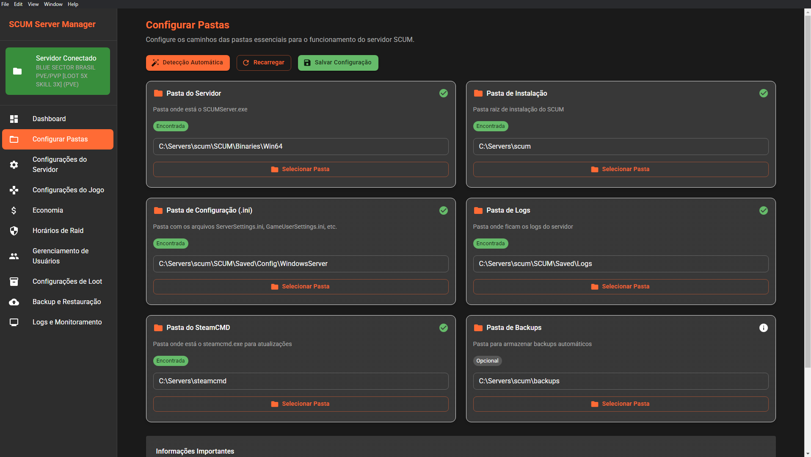
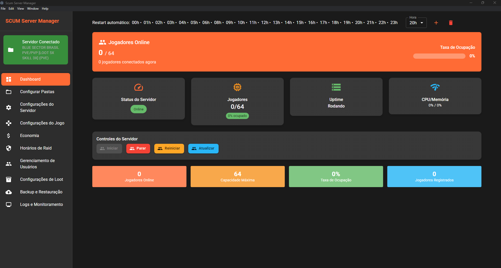
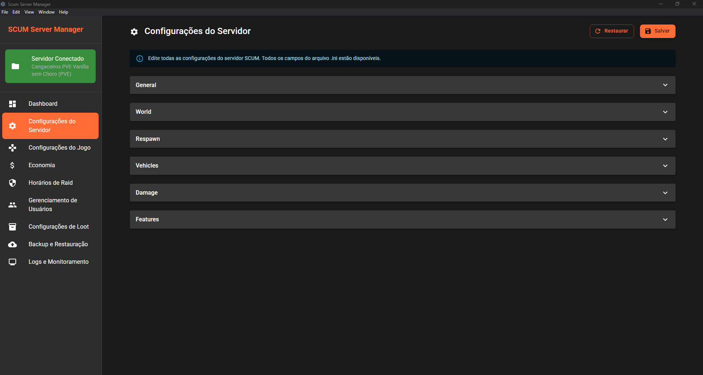

# SCUM Server Manager

Um aplicativo desktop moderno para gerenciar servidores SCUM de forma intuitiva, eficiente e com integração total ao Discord.

## 🚦 Status do Projeto

**Projeto em desenvolvimento ativo!**

Contribuições, feedbacks e testes são muito bem-vindos. Participe para ajudar a construir a melhor ferramenta para a comunidade SCUM!

## ✨ Funcionalidades Principais

- **Dashboard Intuitivo**: Visão geral do servidor, status e estatísticas em tempo real.
- **Configurações completas**: Edite `ServerSettings.ini`, `GameUserSettings.ini`, `EconomyOverride.json`, `RaidTimes.json` e muito mais.
- **Gerenciamento de Usuários**: Admins, whitelist, banimentos e permissões.
- **Sistema de Backup e Restauração**: Backups automáticos e restauração fácil.
- **Monitoramento de Logs**: Logs de destruição de veículos, chat global/local, comandos admin e login de jogadores, todos com envio automático para canais do Discord via webhooks.
- **Painel de Webhooks**: Configure diferentes webhooks para cada tipo de log/evento.
- **Notificações Discord**: Receba alertas de eventos importantes diretamente no seu canal.
- **Interface Moderna**: Desenvolvido com Electron, React, TypeScript e Material-UI.
- **Sistema de Deduplicação**: Persistência inteligente que evita eventos duplicados
- **Proteção contra Rate Limit**: Debounce e delays automáticos para o Discord
- **Tratamento Robusto de Erros**: Recuperação automática de falhas de rede e arquivo

## 🛠️ Tecnologias Utilizadas

- **Electron** (desktop multiplataforma)
- **React** (UI)
- **TypeScript** (tipagem)
- **Material-UI** (design)
- **Vite** (build)

## 📚 Módulos e Páginas

- **Dashboard**: Estatísticas e status do servidor.
- **Configurações do Servidor**: Edição do `ServerSettings.ini`.
- **Configurações do Jogo**: Edição do `GameUserSettings.ini`.
- **Sistema de Economia**: Gerenciamento do `EconomyOverride.json`.
- **Horários de Raid**: Controle de `RaidTimes.json`.
- **Gerenciamento de Usuários**: Admins, whitelist, banimentos.
- **Configurações de Loot**: Ajuste de loot e categorias.
- **Backup e Restauração**: Gerenciamento de backups automáticos.
- **Monitoramento de Logs**: Visualização e envio de logs para Discord.
- **Logs Adm**: Monitoramento de comandos e ações administrativas.
- **Logs de Destruição de Veículos**: Notificações automáticas de destruição de veículos.
- **Chat Global/Local**: Monitoramento e envio de mensagens do chat para Discord.
- **Painel Players Online**: Exibe jogadores online e envia para Discord.

## 🤖 Watchers e Monitoramento Automático

- **adminLogWatcher**: Monitora arquivos `admin_*.log` e envia comandos/admin logs para o Discord.
- **chatGlobalWatcher**: Monitora chat global/local/squad e envia apenas nome e mensagem para o Discord.
- **vehicleDestructionWatcher**: Monitora destruição de veículos e envia eventos para o Discord.
- **loginWatcher**: Monitora logins de jogadores e envia notificações.
- **backupManager**: Gerencia backups automáticos dos arquivos de configuração.

### 🛡️ Proteções e Recursos Avançados

- **Deduplicação Inteligente**: Sistema de persistência que evita envio de eventos duplicados
- **Proteção contra Rate Limit**: Debounce e delays automáticos para evitar HTTP 429 do Discord
- **Tratamento Robusto de Erros**: Ignora arquivos temporários e lida com erros de permissão
- **Processamento Inicial Otimizado**: Apenas eventos novos são enviados na inicialização
- **Limpeza Automática**: Remove eventos antigos dos arquivos de persistência
- **Monitoramento em Tempo Real**: Usando Chokidar para detecção eficiente de mudanças

## 🔔 Integração com Discord

- **Webhooks configuráveis**: Cada tipo de log/evento pode ser enviado para um canal diferente.
- **Logs Adm**: Comandos e ações administrativas.
- **Logs de Destruição de Veículos**: Eventos de destruição com ou sem SteamID.
- **Chat Global/Local**: Apenas nome e mensagem, sem data.
- **Novos Players**: Notificação de novos jogadores.
- **Players Online**: Atualização periódica dos jogadores online.

### 🚦 Proteções Automáticas

- **Rate Limit Protection**: Debounce e delays automáticos para evitar HTTP 429
- **Deduplicação**: Sistema de persistência evita envio de eventos duplicados
- **Tratamento de Erros**: Recuperação automática de falhas de rede
- **Controle de Frequência**: Delays configuráveis entre envios

## 🖼️ Screenshots

### Dashboard

*Visão geral do servidor, status e estatísticas.*

### Configurações dos Arquivos INI

*Edição avançada dos arquivos de configuração do servidor.*

### Configuração de Pastas

*Seleção e gerenciamento das pastas do servidor SCUM.*

### Controle de Usuários

*Gerenciamento de administradores, whitelist e banimentos.*

## 🚀 Instalação

### Pré-requisitos
- Node.js 18+
- npm ou yarn

### Passos
1. Clone o repositório:
   ```bash
   git clone <repository-url>
   cd ScumServerManager
   ```
2. Instale as dependências:
   ```bash
   npm install
   ```
3. Execute em modo de desenvolvimento:
   ```bash
   npm run dev
   ```
4. Para build de produção:
   ```bash
   npm run build
   npm run preview
   ```

## 📁 Estrutura do Projeto

```
ScumServerManager/
├── src/
│   ├── main/                 # Processo principal do Electron
│   │   ├── index.ts         # Ponto de entrada
│   │   ├── fileManager.ts   # Gerenciamento de arquivos
│   │   ├── adminLogWatcher.ts # Monitoramento de logs admin
│   │   ├── chatGlobalWatcher.ts # Monitoramento de chat global/local
│   │   ├── vehicleDestructionWatcher.ts # Monitoramento de destruição de veículos
│   │   ├── loginWatcher.ts  # Monitoramento de login de jogadores
│   │   └── backupManager.ts # Sistema de backup
│   ├── renderer/            # Interface React
│   │   ├── App.tsx         # Componente principal
│   │   ├── components/     # Componentes reutilizáveis
│   │   ├── pages/          # Páginas da aplicação
│   │   └── contexts/       # Contextos React
│   └── types/              # Definições de tipos
├── assets/                  # Imagens e assets do projeto
├── Servers/                 # Pasta dos servidores SCUM
└── package.json
```

## 🛡️ Segurança

- **Validação de Entrada**: Todos os campos são validados.
- **Backup Automático**: Antes de qualquer alteração.
- **Confirmação**: Diálogos para ações críticas.
- **Logs**: Registro de todas as operações.

## 🐛 Solução de Problemas

- **Servidor não detectado**: Verifique se a pasta contém `SCUMServer.exe` e arquivos de configuração.
- **Erro ao salvar**: Verifique permissões de escrita e se o servidor está rodando.
- **Backup não criado**: Verifique espaço em disco e permissões.
- **Logs não enviados ao Discord**: Confira as URLs dos webhooks e permissões de rede.
- **Mensagens duplicadas**: Delete os arquivos `*_processed_events.json` para reprocessar.
- **Rate limit do Discord**: O sistema automaticamente aguarda e tenta novamente.
- **Erro EPERM em network shares**: Comum em redes, tratado automaticamente pelo sistema.
- **Arquivos de persistência grandes**: Limpeza automática a cada 24 horas.

## 🤝 Como Contribuir

1. Fork o projeto
2. Crie uma branch para sua feature (`git checkout -b feature/NomeFeature`)
3. Commit suas mudanças (`git commit -m 'Minha feature'`)
4. Push para a branch (`git push origin feature/NomeFeature`)
5. Abra um Pull Request

### Tipos de Contribuição
- Correção de bugs
- Novas funcionalidades
- Melhorias na documentação
- Sugestões de UI/UX
- Testes
- Feedbacks

## 💬 Sugestões e Feedback

Abra uma issue, participe das discussões ou entre em contato diretamente. Sua opinião é fundamental!

## 📄 Licença

MIT

---

**Desenvolvido com ❤️ para a comunidade SCUM**

## 🎯 Características

### 📋 Funcionalidades Principais

- **Dashboard Intuitivo**: Visão geral do servidor com estatísticas e status
- **Configurações do Servidor**: Edição completa do `ServerSettings.ini`
- **Configurações do Jogo**: Gerenciamento do `GameUserSettings.ini`
- **Sistema de Economia**: Configuração do `EconomyOverride.json`
- **Horários de Raid**: Controle de `RaidTimes.json`
- **Gerenciamento de Usuários**: Administradores, whitelist, banimentos
- **Configurações de Loot**: Spawns, probabilidades e categorias
- **Backup e Restauração**: Sistema completo de backup automático
- **Logs e Monitoramento**: Visualização em tempo real e controle do servidor
- **Sistema de Deduplicação**: Persistência inteligente que evita eventos duplicados
- **Proteção contra Rate Limit**: Debounce e delays automáticos para o Discord
- **Tratamento Robusto de Erros**: Recuperação automática de falhas de rede e arquivo

### 🛠️ Tecnologias Utilizadas

- **Electron**: Aplicativo desktop multiplataforma
- **React**: Interface de usuário moderna
- **TypeScript**: Tipagem estática e melhor desenvolvimento
- **Material-UI**: Design system consistente e responsivo
- **Vite**: Build tool rápido e eficiente

## 🔮 Implementações Futuras

### 1. 📊 Envio de Relatórios de Logs para Discord
- **Webhooks do Discord**: Envio automático de relatórios de logs
- **Notificações em tempo real**: Alertas sobre eventos importantes do servidor
- **Relatórios personalizáveis**: Configuração de quais eventos enviar
- **Canais específicos**: Diferentes webhooks para diferentes tipos de eventos

### 2. 🤖 Parcerias com Bots Existentes
- **Integração com Prisoner Bot**: Parceria com o bot do "Galo Doido"
- **API para bots**: Interface para integração com outros bots SCUM
- **Sistema de plugins**: Arquitetura para facilitar integrações
- **Comunidade de desenvolvedores**: Rede de colaboração entre criadores de bots

> **💡 Interesse em Parceria?** Se você tem contato com o "Galo Doido" ou outros criadores de bots SCUM, seria incrível estabelecer parcerias! Entre em contato conosco.

### 3. 🌐 Site da Comunidade
- **Portal de bots**: Local para a comunidade compartilhar bots criados
- **Repositório centralizado**: Biblioteca de bots e ferramentas
- **Sistema de avaliações**: Feedback da comunidade sobre os bots
- **Integração futura**: Bots aprovados poderão ser instalados diretamente na aplicação

### 4. 💡 Outras Ideias em Desenvolvimento
- **Sistema de templates**: Configurações pré-definidas para diferentes tipos de servidor
- **Análise de performance**: Métricas detalhadas do servidor
- **Sistema de backup na nuvem**: Integração com Google Drive, Dropbox, etc.
- **Interface mobile**: Versão mobile para monitoramento remoto
- **Sistema de notificações**: Alertas por email, SMS, etc.

## 🔧 Configuração

### Arquivos Suportados

- `ServerSettings.ini` - Configurações básicas do servidor
- `GameUserSettings.ini` - Configurações do jogo
- `EconomyOverride.json` - Sistema de economia
- `RaidTimes.json` - Horários de raid
- `AdminUsers.ini` - Lista de administradores
- `WhitelistedUsers.ini` - Lista de usuários autorizados
- `BannedUsers.ini` - Lista de usuários banidos
- `LootOverride.json` - Configurações de loot

### Backup Automático

O sistema cria backups automáticos antes de qualquer alteração:
- Localização: `Servers/Scum/backups/`
- Formato: `YYYY-MM-DD_HH-MM-SS_config-name.zip`
- Retenção: Configurável (padrão: 30 dias)

## 🛡️ Segurança

- **Validação de Entrada**: Todos os campos são validados
- **Backup Automático**: Criação automática antes de alterações
- **Confirmação**: Diálogos de confirmação para ações críticas
- **Logs**: Registro de todas as operações

## 🐛 Solução de Problemas

### Problemas Comuns

1. **Servidor não detectado**
   - Verifique se a pasta contém `SCUMServer.exe`
   - Certifique-se de que os arquivos de configuração existem

2. **Erro ao salvar configurações**
   - Verifique permissões de escrita na pasta
   - Certifique-se de que o servidor não está rodando

3. **Backup não criado**
   - Verifique espaço em disco
   - Confirme permissões de escrita

### Logs de Erro

Os logs são salvos em:
- Windows: `%APPDATA%/ScumServerManager/logs/`
- macOS: `~/Library/Application Support/ScumServerManager/logs/`
- Linux: `~/.config/ScumServerManager/logs/`

## 🤝 Contribuição

### Como Contribuir

1. **Fork o projeto**
2. **Crie uma branch para sua feature** (`git checkout -b feature/AmazingFeature`)
3. **Commit suas mudanças** (`git commit -m 'Add some AmazingFeature'`)
4. **Push para a branch** (`git push origin feature/AmazingFeature`)
5. **Abra um Pull Request**

### Tipos de Contribuição

- **🐛 Bug Fixes**: Correção de problemas existentes
- **✨ Novas Funcionalidades**: Implementação de features solicitadas
- **📚 Documentação**: Melhorias na documentação
- **🎨 UI/UX**: Melhorias na interface do usuário
- **🧪 Testes**: Criação de testes e melhorias na qualidade
- **💡 Sugestões**: Ideias para novas funcionalidades

### Diretrizes de Contribuição

- Mantenha o código limpo e bem documentado
- Siga os padrões de código existentes
- Teste suas mudanças antes de submeter
- Seja respeitoso e construtivo nas discussões

## 💬 Sugestões e Feedback

**TODAS AS SUGESTÕES SERÃO BEM VINDAS!** 

Se você tem ideias para melhorar o projeto, quer sugerir novas funcionalidades ou tem feedback sobre o que já existe, não hesite em:

- Abrir uma issue no GitHub
- Participar das discussões
- Entrar em contato diretamente
- Compartilhar suas experiências de uso

Sua opinião é fundamental para o desenvolvimento do projeto!

## 📄 Licença

Este projeto está sob a licença MIT. Veja o arquivo `LICENSE` para mais detalhes.

## 🙏 Agradecimentos

- Comunidade SCUM por feedback e sugestões
- Desenvolvedores do Electron e React
- Contribuidores do Material-UI
- Todos os que contribuem e apoiam este projeto

## 📞 Suporte

Para suporte, abra uma issue no GitHub ou entre em contato através dos canais oficiais.

---

**Desenvolvido com ❤️ para a comunidade SCUM**

*Este projeto está em constante evolução graças à colaboração da comunidade. Junte-se a nós e ajude a criar a melhor ferramenta de gerenciamento para servidores SCUM!*

## 📸 Screenshots

### Dashboard

*Dashboard principal da aplicação*

### Configurações do Servidor

*Edição avançada das configurações do servidor* 