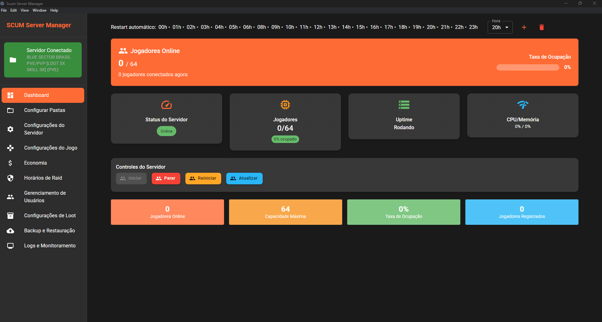
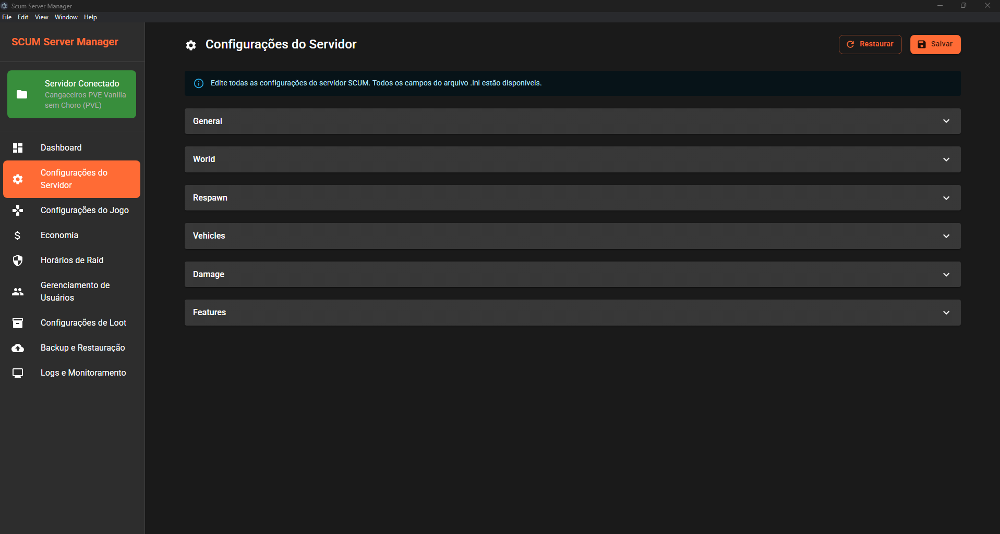

# SCUM Server Manager

Um aplicativo desktop moderno para gerenciar configurações de servidores SCUM de forma intuitiva e eficiente.

## 🚧 Status do Projeto

**Este é um projeto em desenvolvimento inicial!** 

Estamos na fase inicial de desenvolvimento e toda ajuda da comunidade será muito bem-vinda! Se você tem interesse em contribuir, seja com código, sugestões, feedback ou testando o aplicativo, sua participação é fundamental para o sucesso deste projeto.

### 🤝 Como Contribuir

- **Desenvolvedores**: Contribua com código, correções de bugs, novas funcionalidades
- **Testadores**: Teste o aplicativo e reporte bugs ou sugestões de melhorias
- **Comunidade**: Compartilhe ideias, feedback e ajude a espalhar a palavra
- **Documentação**: Ajude a melhorar a documentação e criar tutoriais

## 🎯 Características

### 📋 Funcionalidades Principais

- **Dashboard Intuitivo**: Visão geral do servidor com estatísticas e status
- **Configurações do Servidor**: Edição completa do `ServerSettings.ini`
- **Configurações do Jogo**: Gerenciamento do `GameUserSettings.ini`
- **Sistema de Economia**: Configuração do `EconomyOverride.json`
- **Horários de Raid**: Controle de `RaidTimes.json`
- **Gerenciamento de Usuários**: Administradores, whitelist, banimentos
- **Configurações de Loot**: Spawns, probabilidades e categorias
- **Backup e Restauração**: Sistema completo de backup automático
- **Logs e Monitoramento**: Visualização em tempo real e controle do servidor

### 🛠️ Tecnologias Utilizadas

- **Electron**: Aplicativo desktop multiplataforma
- **React**: Interface de usuário moderna
- **TypeScript**: Tipagem estática e melhor desenvolvimento
- **Material-UI**: Design system consistente e responsivo
- **Vite**: Build tool rápido e eficiente

## 🔮 Implementações Futuras

### 1. 📊 Envio de Relatórios de Logs para Discord
- **Webhooks do Discord**: Envio automático de relatórios de logs
- **Notificações em tempo real**: Alertas sobre eventos importantes do servidor
- **Relatórios personalizáveis**: Configuração de quais eventos enviar
- **Canais específicos**: Diferentes webhooks para diferentes tipos de eventos

### 2. 🤖 Parcerias com Bots Existentes
- **Integração com Prisoner Bot**: Parceria com o bot do "Galo Doido"
- **API para bots**: Interface para integração com outros bots SCUM
- **Sistema de plugins**: Arquitetura para facilitar integrações
- **Comunidade de desenvolvedores**: Rede de colaboração entre criadores de bots

> **💡 Interesse em Parceria?** Se você tem contato com o "Galo Doido" ou outros criadores de bots SCUM, seria incrível estabelecer parcerias! Entre em contato conosco.

### 3. 🌐 Site da Comunidade
- **Portal de bots**: Local para a comunidade compartilhar bots criados
- **Repositório centralizado**: Biblioteca de bots e ferramentas
- **Sistema de avaliações**: Feedback da comunidade sobre os bots
- **Integração futura**: Bots aprovados poderão ser instalados diretamente na aplicação

### 4. 💡 Outras Ideias em Desenvolvimento
- **Sistema de templates**: Configurações pré-definidas para diferentes tipos de servidor
- **Análise de performance**: Métricas detalhadas do servidor
- **Sistema de backup na nuvem**: Integração com Google Drive, Dropbox, etc.
- **Interface mobile**: Versão mobile para monitoramento remoto
- **Sistema de notificações**: Alertas por email, SMS, etc.

## 🚀 Instalação

### Pré-requisitos

- Node.js 18+ 
- npm ou yarn

### Passos de Instalação

1. **Clone o repositório**
   ```bash
   git clone <repository-url>
   cd ScumServerManager
   ```

2. **Instale as dependências**
   ```bash
   npm install
   ```

3. **Execute em modo de desenvolvimento**
   ```bash
   npm run dev
   ```

4. **Para build de produção**
   ```bash
   npm run build
   npm run preview
   ```

## 📁 Estrutura do Projeto

```
ScumServerManager/
├── src/
│   ├── main/                 # Processo principal do Electron
│   │   ├── index.ts         # Ponto de entrada
│   │   ├── fileManager.ts   # Gerenciamento de arquivos
│   │   └── backupManager.ts # Sistema de backup
│   ├── renderer/            # Interface React
│   │   ├── App.tsx         # Componente principal
│   │   ├── components/     # Componentes reutilizáveis
│   │   ├── pages/          # Páginas da aplicação
│   │   └── contexts/       # Contextos React
│   └── types/              # Definições de tipos
├── Servers/                # Pasta dos servidores SCUM
└── package.json
```

## 🎮 Como Usar

### 1. Seleção do Servidor
- Clique em "Selecionar Servidor" na barra lateral
- Navegue até a pasta do seu servidor SCUM
- O aplicativo detectará automaticamente os arquivos de configuração

### 2. Dashboard
- Visualize estatísticas do servidor
- Acesse rapidamente as principais configurações
- Monitore o status em tempo real

### 3. Configurações do Servidor
- Edite `ServerSettings.ini` com interface amigável
- Configure porta, nome, senha, etc.
- Validação automática de campos

### 4. Configurações do Jogo
- Gerencie `GameUserSettings.ini`
- Ajuste dificuldade, loot, experiência
- Interface organizada por categorias

### 5. Sistema de Economia
- Configure `EconomyOverride.json`
- Defina preços, taxas, recompensas
- Sistema de validação integrado

### 6. Horários de Raid
- Gerencie `RaidTimes.json`
- Configure janelas de raid
- Interface de calendário intuitiva

### 7. Gerenciamento de Usuários
- Administradores e permissões
- Whitelist e banimentos
- Interface com abas organizadas

### 8. Configurações de Loot
- Spawns e probabilidades
- Categorias de itens
- Controles avançados

### 9. Backup e Restauração
- Backups automáticos configuráveis
- Restauração com confirmação
- Download de backups

### 10. Logs e Monitoramento
- Visualização de logs em tempo real
- Controles do servidor (iniciar/parar/reiniciar)
- Monitoramento de recursos

## 🔧 Configuração

### Arquivos Suportados

- `ServerSettings.ini` - Configurações básicas do servidor
- `GameUserSettings.ini` - Configurações do jogo
- `EconomyOverride.json` - Sistema de economia
- `RaidTimes.json` - Horários de raid
- `AdminUsers.ini` - Lista de administradores
- `WhitelistedUsers.ini` - Lista de usuários autorizados
- `BannedUsers.ini` - Lista de usuários banidos
- `LootOverride.json` - Configurações de loot

### Backup Automático

O sistema cria backups automáticos antes de qualquer alteração:
- Localização: `Servers/Scum/backups/`
- Formato: `YYYY-MM-DD_HH-MM-SS_config-name.zip`
- Retenção: Configurável (padrão: 30 dias)

## 🛡️ Segurança

- **Validação de Entrada**: Todos os campos são validados
- **Backup Automático**: Criação automática antes de alterações
- **Confirmação**: Diálogos de confirmação para ações críticas
- **Logs**: Registro de todas as operações

## 🐛 Solução de Problemas

### Problemas Comuns

1. **Servidor não detectado**
   - Verifique se a pasta contém `SCUMServer.exe`
   - Certifique-se de que os arquivos de configuração existem

2. **Erro ao salvar configurações**
   - Verifique permissões de escrita na pasta
   - Certifique-se de que o servidor não está rodando

3. **Backup não criado**
   - Verifique espaço em disco
   - Confirme permissões de escrita

### Logs de Erro

Os logs são salvos em:
- Windows: `%APPDATA%/ScumServerManager/logs/`
- macOS: `~/Library/Application Support/ScumServerManager/logs/`
- Linux: `~/.config/ScumServerManager/logs/`

## 🤝 Contribuição

### Como Contribuir

1. **Fork o projeto**
2. **Crie uma branch para sua feature** (`git checkout -b feature/AmazingFeature`)
3. **Commit suas mudanças** (`git commit -m 'Add some AmazingFeature'`)
4. **Push para a branch** (`git push origin feature/AmazingFeature`)
5. **Abra um Pull Request**

### Tipos de Contribuição

- **🐛 Bug Fixes**: Correção de problemas existentes
- **✨ Novas Funcionalidades**: Implementação de features solicitadas
- **📚 Documentação**: Melhorias na documentação
- **🎨 UI/UX**: Melhorias na interface do usuário
- **🧪 Testes**: Criação de testes e melhorias na qualidade
- **💡 Sugestões**: Ideias para novas funcionalidades

### Diretrizes de Contribuição

- Mantenha o código limpo e bem documentado
- Siga os padrões de código existentes
- Teste suas mudanças antes de submeter
- Seja respeitoso e construtivo nas discussões

## 💬 Sugestões e Feedback

**TODAS AS SUGESTÕES SERÃO BEM VINDAS!** 

Se você tem ideias para melhorar o projeto, quer sugerir novas funcionalidades ou tem feedback sobre o que já existe, não hesite em:

- Abrir uma issue no GitHub
- Participar das discussões
- Entrar em contato diretamente
- Compartilhar suas experiências de uso

Sua opinião é fundamental para o desenvolvimento do projeto!

## 📄 Licença

Este projeto está sob a licença MIT. Veja o arquivo `LICENSE` para mais detalhes.

## 🙏 Agradecimentos

- Comunidade SCUM por feedback e sugestões
- Desenvolvedores do Electron e React
- Contribuidores do Material-UI
- Todos os que contribuem e apoiam este projeto

## 📞 Suporte

Para suporte, abra uma issue no GitHub ou entre em contato através dos canais oficiais.

---

**Desenvolvido com ❤️ para a comunidade SCUM**

*Este projeto está em constante evolução graças à colaboração da comunidade. Junte-se a nós e ajude a criar a melhor ferramenta de gerenciamento para servidores SCUM!*

## 📸 Screenshots

### Dashboard

*Dashboard principal da aplicação*

### Configurações do Servidor

*Edição avançada das configurações do servidor* 